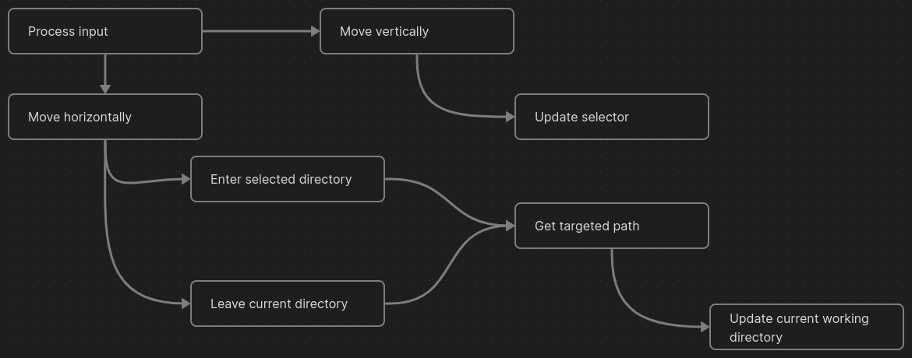

# Faye
1. [About faye](#about-faye)
2. [The opener](#the-opener)
	1. [open_path()](#open_path())
	2. [load_files()](#load_files())
3. [The cache](#the-cache)
	1. [check_cache()](#check_cache())
4. [The navigation](#the-navigation)
	1. [get_hover()](#get_hover())
	2. [get_parent()](#get_parent())
5. [The command bar](#the-command-bar)
	1. [read_cmd()](#read_cmd())
	2. [execute_cmd()](#execute_cmd())
		1. [Bookmarked files](#bookmarked-files)
6. [The wrapper](#the-wrapper)
7. [The UI](#the-ui)
	1. [Files](#files)
		1. [Scroll](#scroll)
		2. [clear_lines()](#clear_lines())
		3. [print_lines()](#print_lines())
		4. [redraw()](#redraw())
8. [Global variables](#global-variables)
9. [Known bugs](#known-bugs)
	1. [memory leaking on free_cache](#memory-leaking-on-free_cache)

## About faye
In search for mastery, inspired by [yazi](https://github.com/sxyazi/yazi) and after another bebop rewatch, faye was born. Faye is a terminal-based file explorer.

## The opener
The most vital part in faye's execution cycle is the capacity to open and read directories. For these objectives two functions are reserved:

### open_path()
Responsible for opening the directory in the global path and storing a reference to it in the cache.

### load_files()
Reads all file names in the current working directory, with the exception of "." and "..", and store them in the cache.

## The cache
In order to minimize some repetitive operations, a caching system is implemented and utilized by faye.

The cache holds all the directories currently opened and the name of all files in the current directory. That way, faye only needs to load files when changing directories.

Also, to minimize the usages of _open_path()_, the cache implements one function:

### check_cache()
This function is responsible for checking if the directory in the global path is already opened in the cache. If so, it updates the current working directory and returns 1. If not, it returns 0.

This means that in practice, _open_path()_ should only be called if the path was not found in the cache.

## The navigation 
The navigation is the process of moving between directories and between files in the same directory. To support it there are two things that need to be tracked:
- Current working directory
- Selector

The description above turns evident the idea that the navigation process happens in two distinct fronts. In faye, these fronts are referred as horizontal moves and vertical moves. 

The flow of the navigation feature is described by the following graph 

In order to get the targeted path, two distinct functions are supported by faye:
### get_hover()
This function is responsible to return the name of the file the selector is pointing at.

### get_parent()
This function is responsible to return the path to the parent of the current working directory.

## The command bar 
The command bar feature allows the user to utilize commands. At the time, the only commands supported are the ones starting with "!" that are executed by the shell, outside faye.

The faye program do **not** end at the execution of a shell command! The command is executed after a fork.

In order to achieve a flexible command bar, one function is implemented:
### read_cmd()
It is responsible for reading an unknown sized input and storing it somewhere for the following execution.

The execution itself is handled by another function:
### execute_cmd()
This function is responsible **only** for the execution of the command typed the forking should happen **before** the call of this function.  

It executes the first word of the string typed in the command bar, passing the next words as arguments.

#### Bookmarked files
In order to ease the usage of the command bar, faye also implements a simple bookmarking. Bookmarked files are passed as arguments to the next command, they also have priority as arguments, all arguments typed in the command bar are discarded if there are files bookmarked. 

## The wrapper 
The wrapper is a shell function to be included at one initializing script of the user to make faye able to keep cwd on exit.

In order to achieve this, faye changes its input when caller is not a tty. In this case, all it outputs to stdout is cwd at the end.

The functionality of faye shall not be changed by that, although unable to write to stdout, faye finds a way to still write to the screen.

## The UI 
To better isolate the processes an independent UI drawing system makes itself needed.

Without much compromise, there are some vital information faye must display, such as:
- Current working directory
- List of files in this directory
- Bookmarked file if available
- Selected file in the current directory

It is important to notice that there is no need to redraw every frame, only after updates. With this approach it becomes evident that the components update independently, so they should also be drawn separately.

### Files
The first component to be tackled is the _content_ of a directory. The reason it was the chosen as the first  is that, from the start it was broken. 

Because of the way files were displayed until now, if a directory had more than 20 files, the space reserved for them would not be enough and all the intended placement would be lost. 

This will serve as an opportunity to implement a simple scroll.

Basically, the content only need to be redrawn when there is a change on the directory, the changes could come from multiple angles:
- Scroll
- Show/Hide hidden files
- Move between directories

#### Scroll
A simple way to implement the scroll is by keeping track of the first file that should be drawn and also how many files should be drawn. The first item is then updated when the selector is in either end of the content, scrolling up or down accordingly. 

Of course this would also mean that the selector position on screen is not equal to the value its holding. The value of the selector on screen is given by (selector-first_draw).

Now, for the actual drawing. Three functions are defined:
- clear_lines(int, int, int);
- print_lines(char**, int, int, int);
- redraw(char**, int, int, int);

The function actually called for redrawing the content is redraw(). The other two functions serve their own purpose. 

#### clear_lines()
The first, clear_lines is called before every redraw, it is a smarter cleaner than the ncurses clear(). It takes 3 arguments: line_count, x and y. The function then clears line_count lines, starting at the yth row of the screen and at the xth column.  

#### print_lines()
This function does as suggested and does print the lines. It takes as arguments an array of strings, the count of strings inside the array, x and y.

The function then prints the maximum amount of strings possible in the screen: could be either the full array or the max allowed by the UI.

x and y serves as offset values, allowing the printing to be adjusted on screen if needed. The printing will start at the xth column on the yth row of the screen.

#### redraw()
At last, redraw. This function print the lines passed as argument **if** necessary.

The arguments are the same as print_lines'.

With these, the file redrawing is properly isolated and working.

## Global variables
In order to ease the development faye utilizes some global variables. Although the _name_ of these variables could not be called descriptive, their types are.

The global variables of faye are:
- jet
- ed
- ein
- julia

Their types are, respectively:
- navigator
- cmd
- cache
- content

At last there are two other global variables to help faye display its output at the right place:
- faye_out
- faye_screen

Their types are respectively:
- FILE*
- SCREEN*

## Known bugs
### memory leaking on free_cache
Freeing allocated memory for _filenames_ consider _files_ as the amount to be freed but _files_ could decrease in a normal execution, meaning that the freed memory is less than the allocated. 
